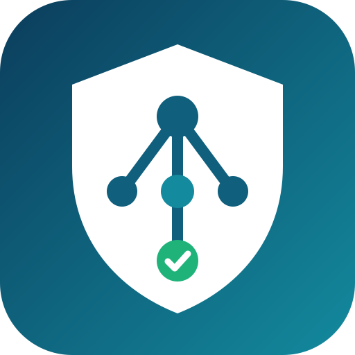
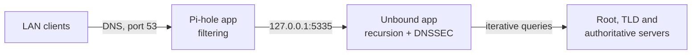

  

<h1 align="center">Unbound for Home Assistant</h1>

  Recursive, caching and DNSSEC-validating DNS resolver as a Home Assistant app — 
  the private upstream for Pi-hole, without any third-party DNS provider.

  
  
  
  

  

## Why Unbound?

Pi-hole filters DNS, but it still forwards every allowed query to an upstream resolver such as your ISP, Google or
Cloudflare — which then sees your complete query history. With this app, Pi-hole forwards to Unbound on the same
host instead, and Unbound resolves each name itself, starting at the root servers.

- **No single upstream provider** receives all of your queries.
- **DNSSEC validation** rejects forged or manipulated answers.
- **Everything stays on your Home Assistant host** — no extra device, container host or VM.

> Queries to the root, TLD and authoritative servers are unencrypted. Unbound removes the central upstream provider,
> but it does not hide DNS traffic from someone who can observe your internet connection.

## Features

- Recursive, caching resolver with prefetching of popular entries
- DNSSEC validation with an automatically maintained trust anchor (RFC 5011); ships both root keys KSK-2017 and KSK-2024
- Listens **only on `127.0.0.1:5335`**: not reachable from the LAN, no conflict with DNS on port 53 or mDNS on port 5353
- Runs as the unprivileged user `unbound` from the first command on, without any Linux capabilities
- Protection against DNS rebinding for private IPv4 and IPv6 ranges
- Zero configuration: install, start, point Pi-hole at it
- `amd64` and `aarch64` (e.g. Home Assistant Green/Yellow, Raspberry Pi 4/5, x86 mini PCs and VMs)
- Automatic patch releases when Unbound, OpenSSL or any other Alpine package in the image receives an update

## How it works

## Support

If you like the app and would like to support my work, you can buy me a coffee:

## Installation

1. Click the button above, or open *Settings → Apps → App store → ⋮ → Repositories* and add
   `https://github.com/TimInTech/ha-addon-unbound`.
2. Install **Unbound** and start it.
3. In Pi-hole open *Settings → DNS*, disable all upstream servers and set the custom upstream `127.0.0.1#5335`.
   Leave *Use DNSSEC* in Pi-hole disabled — Unbound already validates.

The Pi-hole app must use the host network, for example
[casperklein's Pi-hole app](https://github.com/casperklein/homeassistant-addons/tree/master/pi-hole).
Do not combine Unbound with the DNSCrypt option of that app: its dnscrypt-proxy also listens on `127.0.0.1:5335`.

Details, verification and limitations: **[documentation](unbound/DOCS.md)**.

## Quality and maintenance

| Area | What runs |
| --- | --- |
| **CI** (`ci.yml`) | App linter, ShellCheck, `amd64`/`aarch64` builds and `tests/smoke.sh --hardened` (resolution, DNSSEC, restart, unprivileged start with `--cap-drop ALL`) on every push to `main` and every pull request |
| **Package updates** (`package-updates.yml`) | Every Monday: rebuilds the image and compares the Alpine packages with [`unbound/apk-packages.txt`](unbound/apk-packages.txt). On a change, a read-only `check` job runs the smoke test, an `aarch64` build and the linter; only then does the `release` job, which runs no third-party actions, commit a patch release with changelog |
| **Dependabot** | Weekly pull requests for the Alpine base image and the GitHub Actions, which are pinned to commit SHAs |

GitHub pauses scheduled workflows after 60 days without repository activity; re-enable *Package updates* in the
Actions tab if that happens.

## Security

Please report vulnerabilities privately, see [SECURITY.md](SECURITY.md).

## Credits

[Unbound](https://github.com/NLnetLabs/unbound) is developed by [NLnet Labs](https://www.nlnetlabs.nl/) and
licensed under the BSD 3-Clause license. This project packages it for Home Assistant and is not affiliated with
NLnet Labs or the Home Assistant project.

## License

The files in this repository are licensed under the [MIT License](LICENSE).
